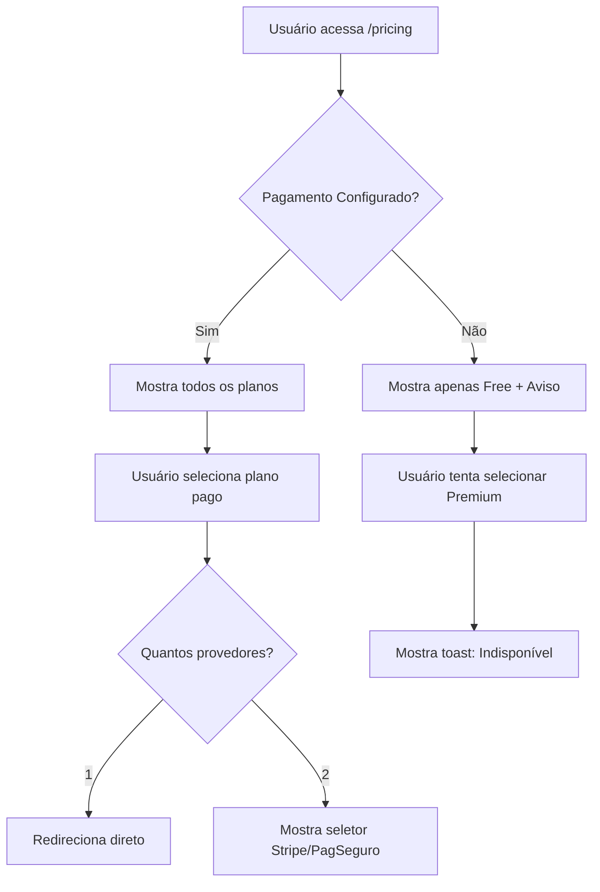

# Sistema de Controle de Planos Pagos

## 📋 Visão Geral

Este sistema garante que os planos pagos (Premium, Família e Enterprise) só fiquem disponíveis quando o sistema de pagamento estiver **devidamente configurado** com credenciais válidas do Stripe ou PagSeguro.

## 🎯 Funcionalidades

### 1. **PaymentConfigService**
Serviço centralizado que verifica a configuração dos provedores de pagamento.

**Localização:** `src/app/services/payment-config.service.ts`

#### Métodos Principais:

```typescript
// Verifica se o Stripe está configurado
isStripeConfigured(): boolean

// Verifica se o PagSeguro está configurado
isPagSeguroConfigured(): boolean

// Verifica se ALGUM provedor está configurado
isPaymentConfigured(): boolean

// Verifica se os preços/planos estão configurados
arePlanPricesConfigured(): boolean

// Retorna os provedores disponíveis
getAvailableProviders(): string[]

// Retorna status completo da configuração
getConfigurationStatus(): {
  configured: boolean;
  message: string;
  providers: string[];
}
```

### 2. **Página de Pricing Ajustada**

**Localização:** `src/app/pages/pricing/pricing.page.ts`

#### Comportamento:

✅ **Pagamento Configurado:**
- Mostra todos os planos (Free, Premium, Família, Enterprise)
- Permite seleção de planos pagos
- Mostra opções de pagamento disponíveis (Stripe/PagSeguro)

❌ **Pagamento NÃO Configurado:**
- Mostra apenas o plano **Free**
- Exibe aviso visual sobre configuração pendente
- Bloqueia tentativa de assinar planos pagos
- Mensagem: "Sistema de pagamento não configurado"

## 🔍 Como Funciona

### Detecção de Configuração

O serviço verifica:

1. **Stripe:**
   - Se `testPublishableKey` não contém "REPLACE"
   - Se começa com "pk_" (formato válido)
   - Se os Price IDs não contêm "REPLACE"

2. **PagSeguro:**
   - Se `testPublicKey` não contém "REPLACE" ou "PUBLIC_KEY"
   - Se os Plan IDs não contêm "PLAN_TEST"

### Fluxo de Exibição

```
┌─────────────────────────────────┐
│  Usuário acessa /pricing        │
└────────────┬────────────────────┘
             │
             ▼
┌─────────────────────────────────┐
│ PaymentConfigService.           │
│ checkPaymentConfiguration()     │
└────────────┬────────────────────┘
             │
     ┌───────┴────────┐
     │                │
     ▼                ▼
┌─────────┐    ┌──────────────┐
│Configurado│    │Não Configurado│
└────┬────┘    └──────┬───────┘
     │                │
     ▼                ▼
┌──────────┐    ┌─────────────┐
│Mostra    │    │Mostra apenas│
│todos os  │    │plano Free + │
│planos    │    │aviso        │
└──────────┘    └─────────────┘
```

## 🚀 Exemplos de Uso

### Verificar Status da Configuração

```typescript
import { PaymentConfigService } from './services/payment-config.service';

constructor(private paymentConfig: PaymentConfigService) {}

checkPayment() {
  const status = this.paymentConfig.getConfigurationStatus();
  
  console.log('Configurado:', status.configured);
  console.log('Mensagem:', status.message);
  console.log('Provedores:', status.providers); // ['stripe', 'pagseguro']
}
```

### Filtrar Planos Disponíveis

```typescript
// Na página de pricing
getAvailablePlans(): PlanCard[] {
  if (this.paymentConfigured()) {
    return this.plans; // Todos os planos
  }
  return this.plans.filter(p => p.plan === 'free'); // Apenas Free
}
```

### Bloquear Seleção de Plano

```typescript
async selectPlan(plan: SubscriptionPlan) {
  // Bloqueia se pagamento não configurado
  if (!this.paymentConfigured() && plan !== 'free') {
    await this.showToast(
      'Sistema de pagamento não configurado.',
      'warning'
    );
    return;
  }
  
  // Continua com a assinatura...
}
```

## 🎨 Interface do Usuário

### Aviso de Configuração Pendente

Quando o pagamento não está configurado, exibe um card de aviso:

```html
<ion-card *ngIf="!paymentConfigured()" class="warning-card">
  <ion-card-content>
    <div class="warning-content">
      <ion-icon name="warning-outline" color="warning"></ion-icon>
      <div class="warning-text">
        <h3>Sistema de Pagamento não configurado</h3>
        <p>{{ configStatus().message }}</p>
        <p><small>Apenas o plano gratuito está disponível.</small></p>
      </div>
    </div>
  </ion-card-content>
</ion-card>
```

### Listagem Dinâmica de Planos

```html
<ion-col *ngFor="let plan of getAvailablePlans()">
  <!-- Renderiza apenas planos disponíveis -->
</ion-col>
```

## 🔒 Segurança

### Validações Implementadas:

1. ✅ Verifica formato das chaves (pk_test_, pk_live_)
2. ✅ Detecta placeholders (REPLACE, PUBLIC_KEY, etc.)
3. ✅ Valida Price IDs e Plan IDs
4. ✅ Bloqueia tentativas de assinatura sem configuração
5. ✅ Exibe apenas provedores configurados no checkout

### Benefícios:

- **Previne erros:** Usuários não tentam assinar sem pagamento configurado
- **UX melhor:** Mensagens claras sobre indisponibilidade
- **Manutenção:** Fácil adicionar novos provedores
- **Flexibilidade:** Funciona com Stripe, PagSeguro ou ambos

## 📝 Configuração

### Passo 1: Configure as Credenciais

Edite `src/environments/environment.ts`:

```typescript
stripe: {
  testPublishableKey: 'pk_test_SEU_KEY_REAL_AQUI', // ✅ Remove "REPLACE"
  prices: {
    premium: {
      monthly: 'price_1234567890', // ✅ ID real do Stripe
      yearly: 'price_0987654321'
    }
    // ... outros planos
  }
}
```

### Passo 2: Teste a Configuração

No console do navegador:

```javascript
// Injetar o serviço (Angular DevTools)
const service = ng.probe($0).injector.get(PaymentConfigService);

// Verificar status
console.log(service.getConfigurationStatus());
// Output: { configured: true, message: "Pagamento configurado via STRIPE", providers: ["stripe"] }
```

### Passo 3: Verificação Visual

Acesse `/pricing`:
- ✅ **Configurado:** Mostra todos os planos
- ❌ **Não configurado:** Mostra apenas "Free" + aviso amarelo

## 🧪 Testes

Execute os testes unitários:

```bash
npm run test -- --include='**/payment-config.service.spec.ts'
```

Cobertura esperada:
- ✅ Detecção de Stripe configurado/não configurado
- ✅ Detecção de PagSeguro configurado/não configurado
- ✅ Verificação de planos disponíveis
- ✅ Mensagens de status corretas

## 📊 Fluxo Completo



## 🛠️ Manutenção

### Adicionar Novo Provedor

1. Adicione credenciais em `environment.ts`
2. Atualize `PaymentConfigService.isXXXConfigured()`
3. Adicione lógica em `getAvailableProviders()`
4. Teste a detecção

### Customizar Mensagens

Edite `PaymentConfigService.getConfigurationStatus()`:

```typescript
getConfigurationStatus() {
  // Customize as mensagens aqui
  if (!configured) {
    message = 'SUA MENSAGEM CUSTOMIZADA';
  }
}
```

## 📚 Arquivos Relacionados

- `src/app/services/payment-config.service.ts` - Serviço principal
- `src/app/services/payment-config.service.spec.ts` - Testes
- `src/app/pages/pricing/pricing.page.ts` - Integração na UI
- `src/app/pages/pricing/pricing.page.html` - Template
- `src/app/pages/pricing/pricing.page.scss` - Estilos do aviso

## ✅ Checklist de Implementação

- [x] Criar `PaymentConfigService`
- [x] Adicionar métodos de verificação (Stripe/PagSeguro)
- [x] Integrar na página de Pricing
- [x] Adicionar aviso visual quando não configurado
- [x] Filtrar planos disponíveis dinamicamente
- [x] Bloquear seleção de planos pagos sem configuração
- [x] Adaptar seletor de pagamento (1 ou 2 provedores)
- [x] Criar testes unitários
- [x] Documentar funcionalidade
- [x] Adicionar estilos para warning card

## 🎯 Próximos Passos

1. **Configurar Credenciais Reais:**
   - Seguir `CREDENTIALS-SETUP-GUIDE.md`
   - Obter chaves do Stripe e PagSeguro
   - Atualizar `environment.ts`

2. **Testar Fluxo Completo:**
   - Verificar exibição com/sem configuração
   - Testar assinatura com ambos provedores
   - Validar bloqueio de planos pagos

3. **Deploy:**
   - Configurar Firebase Functions Secrets
   - Deploy com `firebase deploy --only functions`
   - Configurar webhooks nos dashboards

---

**Status:** ✅ Implementado e funcional  
**Versão:** 1.0.0  
**Data:** 2025-01-10
